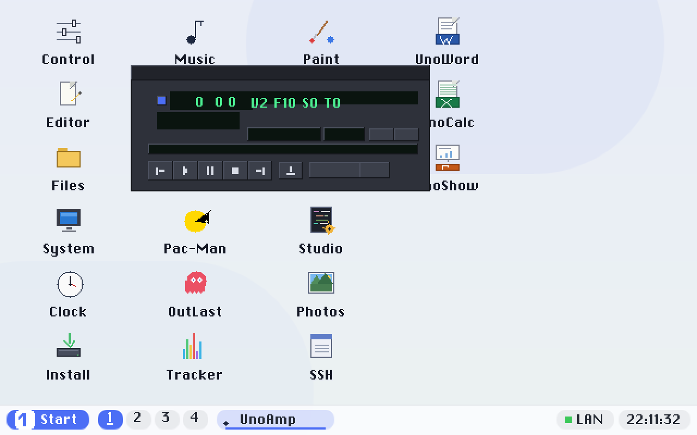
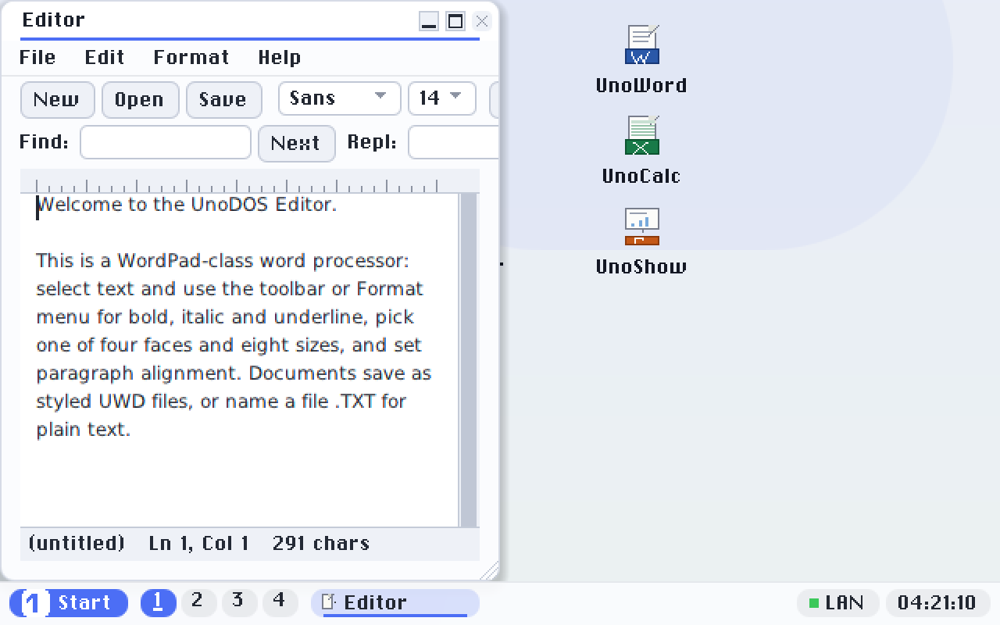
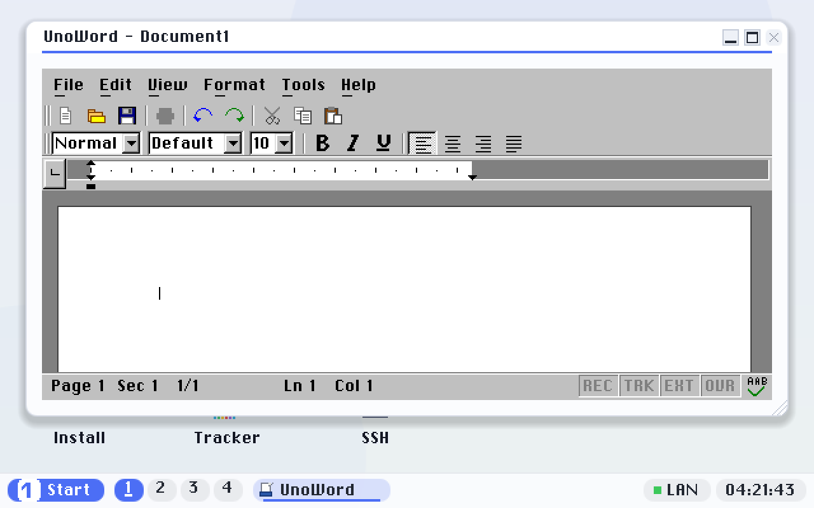
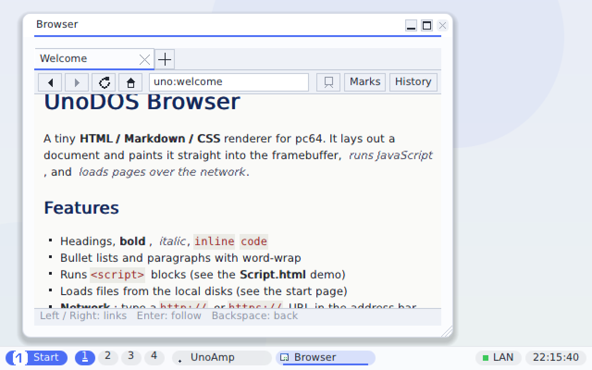
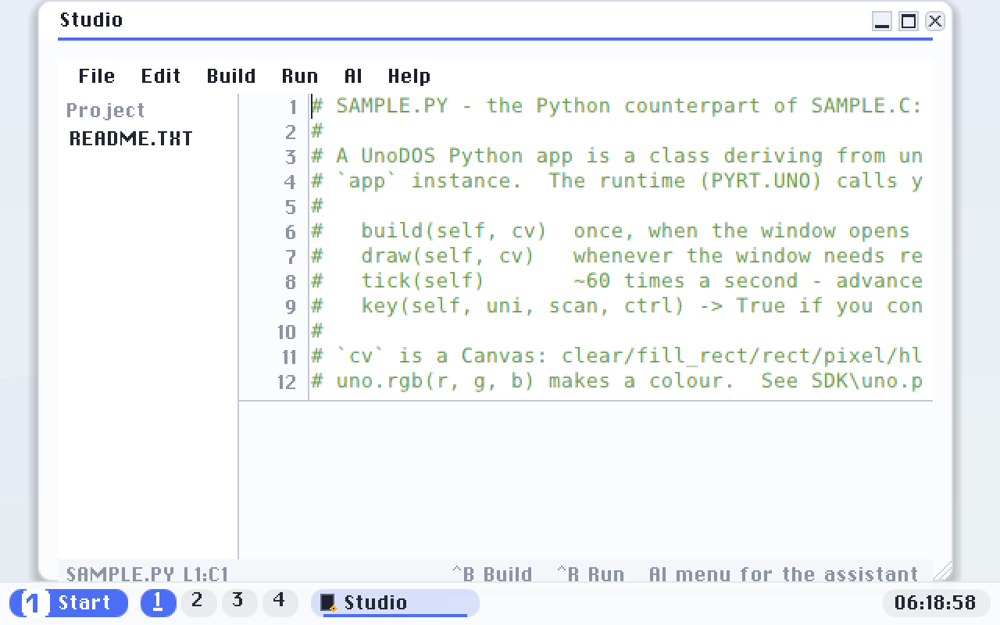

# UnoDOS


[](https://github.com/hmofet/unodos/releases)
[](https://hmofet.github.io/unodos/)

**One source tree, one design, twenty-two machines**, from an IBM PC/XT with an
8088 to the modern laptop on your desk.

UnoDOS is a family of graphical operating systems. It began as a GUI-first,
16-bit real-mode OS written entirely in x86 assembly, fitting a kernel, a
window manager, two filesystems, cooperative multitasking and a full
application set on a single 1.44 MB floppy. It has since grown into a
contract-driven family of ports spanning home computers, consoles, handhelds,
single-board computers and a phone, and its flagship is now **pc64**: UnoDOS
running bare-metal on any modern 64-bit PC, on its own drivers, with its own
network stack, browser, office suite, compiler and hypervisor.



## Try it

Prebuilt images for every platform are on the
[releases page](https://github.com/hmofet/unodos/releases): a hybrid ISO and
USB disk image for modern PCs, cartridge ROMs for the consoles and handhelds,
disk images for the home computers, and SD-card payloads for the boards. Most
of them run in an emulator within a minute; the
[user manual](https://hmofet.github.io/unodos/) walks through booting real
hardware, including one-click USB flasher apps for Windows and macOS.

---

## UnoDOS pc64, the modern-PC flagship

[pc64](pc64/) boots bare-metal on essentially any x86-64 PC made since ~2007.
UEFI plays the role the BIOS plays for the classic OS: the firmware hands over
a framebuffer, a keyboard and the boot volume, and then, on most machines,
**UnoDOS calls `ExitBootServices` and the firmware leaves**. From that point
the OS runs entirely on its own drivers. A hybrid disk image boots the same OS
on legacy-BIOS machines too.

### A complete desktop

The shell is built on **unoui**, the family's cross-platform widget toolkit: a
windowed desktop with a taskbar, virtual desktops, window snapping, an
animated Alt-Tab switcher, desktop icons and a programs menu. Ten themes are
live-switchable, from **Aurora** (the modern flat default, in light and dark)
to faithful retro looks (Mac OS 7, 1-bit Mac Plus, Windows 3.1, Amiga
Workbench, C64, Apple II, NeXTSTEP). Text is kerned, anti-aliased TrueType
with bundled open fonts, and every control is reachable by pointer or
keyboard.

| | |
|---|---|
|  |  |
|  |  |

### The applications

- **UnoWord, UnoCalc, UnoShow**: an Office 97-class suite that reads and
  writes the real Microsoft binary formats (`.doc`, `.xls`, `.ppt`) through
  the in-tree [unodoc](unodoc/) library.
- **Browser**: HTML, Markdown and CSS rendering with cookies, cache, find and
  save, HTTP and CA-validated TLS 1.2 HTTPS, and **two switchable JavaScript
  engines**: the in-tree [unojs](unojs/) bytecode VM and vendored quickjs-ng,
  with a libcss-based layout engine option behind the same seam.
- **Studio**: an IDE that runs on the OS itself, with syntax highlighting, a
  build-and-run loop, an AI assistant, and **UnoC**, a built-in C compiler
  that compiles native UnoDOS apps on UnoDOS.
- **Python**: MicroPython as a first-class runtime (`PYRT.UNO`) with a `uno`
  API into the shell, filesystem and network.
- **Music, UnoAmp, Photos**: from-scratch WAV, MIDI, MP3 and AAC-LC decoders
  ([unomedia](unomedia/)); UnoAmp is a Winamp 2 clone that loads classic
  skins; Photos views the common image formats.
- **SSH**: a native SSH client (ed25519, in-tree crypto).
- Plus Files, Editor, Paint, Tracker, Clock, Control Panel, System, a log
  viewer, the games (Dostris, Pac-Man, OutLast) and Runner3D, the showcase
  for the [uno3d](uno3d/) 3D library.

Apps are **loadable `.UNO` modules** carrying their own descriptors: drop one
into `APPS\` and the shell discovers it. No rebuild, no reboot.

### Its own hardware support

Everything below the firmware line is native, written for this tree:

- **Storage**: AHCI, NVMe, SDHCI/eMMC and USB mass storage under a common
  block layer, a native FAT16/FAT32 driver, GPT/ESP authoring.
- **USB**: a polled xHCI host stack with hubs, HID keyboards and mice, mass
  storage, and USB Ethernet (ASIX AX88179, Realtek RTL8152).
- **Networking**: wired NICs (Intel e1000/e1000e/igb, Realtek r8169) and
  **Wi-Fi** (Intel, Realtek, Marvell drivers) with WPA2, over a from-scratch
  TCP/IP stack: ARP, IPv4, ICMP, UDP, TCP, DHCP, DNS, TLS (BearSSL), sockets
  and syslog in both directions.
- **Input**: PS/2, I2C-HID (native laptop trackpads) and USB HID.
- **Audio**: Intel HDA with AC'97 fallback into a 48 kHz DMA ring.
- **ACPI**: an in-tree AML interpreter ([unoacpi](unoacpi/)).

### A hypervisor

[unovirt](pc64/UNOVIRT.md) enters VMX operation on Intel hardware and runs
guests behind EPT with virtio devices: **a real Ubuntu kernel boots under
UnoDOS, reaches userspace, answers at its shell, and mounts an ext4 disk**
served from a file on a UnoDOS volume. The Appliances app and VM manager
front it; an AMD/SVM backend is written and awaiting hardware proof.

### Install, manage, automate

- **Installer**: non-destructive install onto an existing disk's ESP, or a
  whole-disk clone; a running machine can also be reinstalled **over the
  network**.
- **unosecure**: local accounts, RBAC and an audit trail.
- **URC**: a remote-control channel (fail-closed verb gate, one-time console
  arming) that drives real machines headlessly: deploying builds, running
  tests, streaming the screen. It is how the hardware fleet is validated
  without a human at the keyboard.
- **Debug builds**: a behavioral spec ([pc64/SPEC.md](pc64/SPEC.md)) executed
  as an on-metal conformance test, plus watchdogs, fault telemetry and a
  stress harness.

### Proven on real machines

Validated on a Lenovo ThinkPad X1 Carbon Gen 8 (native trackpad, Wi-Fi, live
theme and resolution switching), on an always-on ZimaBlade test box (boots
from USB, detaches from the firmware, runs fully native), and on QEMU+OVMF
harnesses that boot the real image on every change. The design notes in
[pc64/README.md](pc64/README.md) record the firmware traps only real hardware
exposes; they are half the value of the port.

### Build it

```bash
sudo apt install gcc-mingw-w64-x86-64 qemu-system-x86 ovmf python3 python3-pil
cd pc64
./build.sh            # -> build/esp/EFI/BOOT/BOOTX64.EFI
./build.sh run        # boot it in QEMU+OVMF
```

The whole port builds with stock packages, no EDK2. See
[pc64/DEVELOPMENT.md](pc64/DEVELOPMENT.md) for Linux and Windows environment
setup and [pc64/README.md](pc64/README.md) for the full architecture tour.

---

## The family

### One contract, many worlds

UnoDOS 3.1 is contract-driven: a single machine-readable Contract
([unodef/](unodef/)) defines screen geometry, the window and event layout and
the shared enums, and every world is generated from it or checked against it.
The assembly ports and the x86 reference consume it byte-identically, and
eleven ports were built **fresh** on the 3.1 architecture rather than
migrated, proving that a new target costs a small generated surface. See
[docs/UNODOS-3.1-MIGRATION.md](docs/UNODOS-3.1-MIGRATION.md) and
[docs/CONTRACT-ARCH.md](docs/CONTRACT-ARCH.md).

### The ports

Every port boots a UnoDOS desktop with the shared app set: Files, Notepad,
Music, Theme, Tracker, Paint and the games (Dostris, OutLast, Pac-Man),
scaled to what the machine can hold, down to a launcher profile on 2 KB of
RAM. A feature-by-feature comparison lives in
[docs/FEATURE-MATRIX.md](docs/FEATURE-MATRIX.md).

**Home computers**

| Port | CPU | Highlights |
|---|---|---|
| [IBM PC/XT (x86)](kernel/) | 8088+ | The reference OS; see below. ✅ real hardware, incl. a cycle-accurate 8088 |
| [Amiga](amiga/) | 68000 | Self-booting ADF, copper/bitplanes, Paula audio, disk-loaded apps, PC-interchangeable FAT12 |
| [Commodore 64](c64/) | 6510 | Hi-res bitmap desktop with per-cell colour, SID, CIA TOD clock, all apps disk-loaded |
| [VIC-20](vic20/) | 6502 | Fresh 3.1 world on the 22×23 character matrix |
| [Apple II](apple2/) | 6502 | Own GCR 6-and-2 RWTS, hi-res renderer, disk-loaded apps |
| [Apple IIGS](iigs/) | 65C816 | Super Hi-Res desktop, Ensoniq DOC audio, FAT12 over SmartPort, full app parity |
| [Mac System 1–7](mac/) | 68000+ | Hosted Toolbox port (1-bit and Color QuickDraw), app-free core, loadable modules |
| [MacPlus (standalone OS)](macplus/) | 68000 | Bare-metal: own boot blocks, drivers and renderer. ✅ real Mac SE |
| [PowerPC Mac](ppcmac/) | PPC G3/G4 | Open Firmware client, the first big-endian PowerPC world |

**Consoles and handhelds**

| Port | CPU | Highlights |
|---|---|---|
| [Sega Genesis](genesis/) | 68000 | VDP tile desktop, SRAM/tape/Sega-CD storage. ✅ boots on real hardware |
| [Super Nintendo](snes/) | 65816 | Shadow+DMA tilemap model, SPC700 audio driver. 🟡 conditional pass on clone hardware |
| [NES](nes/) | 6502 | 2 KB of RAM. ✅ validated on a real AV Famicom |
| [PC Engine](pce/) | HuC6280 | ✅ validated on a Turbo EverDrive |
| [Master System](sms/) / [Game Gear](gg/) | Z80 | The first contract-driven port and its 12-bit-colour sibling |
| [Game Boy / Color](gb/) | SM83 | One ROM boots DMG greyscale and GBC colour |
| [Game Boy Advance](gba/) | ARM7TDMI | The first ARM world, on a Mode-3 framebuffer |
| [WonderSwan](ws/) | V30MZ | The first x86 handheld |
| [PlayStation 2](ps2/) | R5900 | Portable C core over the Graphics Synthesizer; memory-card storage, USB input |
| [Dreamcast](dreamcast/) | SH-4 | Same C core over PowerVR2; VMU storage; 60 fps in Flycast |

**Boards and mobile**

| Port | CPU | Highlights |
|---|---|---|
| [Raspberry Pi](rpi/) | AArch64 | The first 64-bit world, on the VideoCore mailbox framebuffer |
| [PinePhone](pinephone/) | AArch64 | Portrait 480×640 on the Allwinner DE2, self-booting microSD |

Several ports are validated on real silicon (NES, PC Engine, Genesis, Mac SE,
the x86 line, pc64's laptop and SBC fleet); the rest are verified in
emulators or on ROM-free instruction-level harnesses (Unicorn, py65, a
from-scratch 65816 core), so no proprietary ROMs are needed to build or test
anything.

### The classic OS (the x86 reference)

The original UnoDOS 3: a GUI-first OS for IBM PC XT-compatibles, written
entirely in real-mode x86 assembly. No DOS, no runtime, just the BIOS and an
Intel 8088 or later.

- Boots from a 1.44 MB floppy (or hard drive, CompactFlash, USB) straight
  into a windowed desktop: draggable icons, mouse support, a 16-window
  z-ordered window manager with outline drag and resize.
- A ~46 KB kernel exposing **106 system calls** over `INT 0x80`: graphics in
  four video modes (CGA 320×200 to VESA 640×480), a 15-widget GUI toolkit
  with file dialogs, FAT12 and FAT16 read/write, cooperative multitasking (5
  concurrent apps plus the shell in 640 KB), a system clipboard, three bitmap
  fonts and PC-speaker audio.
- **19 applications**, from a full text editor and file manager to Paint,
  Tracker, Settings, a boot-floppy creator and three games.
- Runs at full feature parity on a genuine 8088 at 4.77 MHz, verified on a
  cycle-accurate XT (Microsoft serial mouse on COM1, XT-IDE CompactFlash
  boot) and on real hardware from a 386SX to an Atom netbook. See
  [docs/PORT-8088.md](docs/PORT-8088.md).

Build and run it:

```bash
sudo apt install nasm qemu-system-x86 make python3
make floppy144        # build/unodos-144.img, a bootable FAT12 floppy
make run144           # boot it in QEMU
```

`make hd-image` builds the 64 MB FAT16 hard-drive image;
[tools/write.ps1](tools/write.ps1) writes images to physical media on Windows
(with system-drive exclusion and read-back verify), and plain `dd` does it on
Linux.

Apps are flat NASM binaries in their own 64 KB segments; a minimal windowed
app is about 60 lines. Start with the
[app development guide](docs/APP_DEVELOPMENT.md), the
[API reference](docs/API_REFERENCE.md) (all 106 calls with register-level
detail) and [docs/ARCHITECTURE.md](docs/ARCHITECTURE.md).

### Shared subsystems

The ports stay small because the heavy machinery is shared:

| Library | What it is |
|---|---|
| [unodef](unodef/) | The Contract: one machine-readable definition every world is generated from |
| [unoui](unoui/) | Cross-platform widget toolkit and themes ([docs/UNOUI.md](docs/UNOUI.md)) |
| [uno3d](uno3d/) | Portable 3D pipeline with software, PS2 GS and Dreamcast PVR backends ([docs/UNO3D.md](docs/UNO3D.md)) |
| [unomedia](unomedia/) | Image and audio decoders (WAV, MIDI, MP3, AAC-LC, and the common image formats), from scratch |
| [unodoc](unodoc/) | Microsoft binary document formats: CFB and `.doc`/`.xls`/`.ppt`, read and write |
| [unonet](unonet/) | The network stack the pc64 drivers feed |
| [unojs](unojs/) / [unoweb](unoweb/) | JavaScript engine and DOM/HTML/CSS layout engine |
| [unofs](unofs/), [unosound](unosound/), [unosched](unosched/), [unobus](unobus/), [unoacpi](unoacpi/) | Filesystems, audio sequencing, scheduling, buses, ACPI |

## Repositories and branches

- **`master`** (this repo, [hmofet/unodos](https://github.com/hmofet/unodos)):
  the forward, contract-driven line and the home of pc64. All current
  development happens here.
- **[hmofet/unodos-3-legacy](https://github.com/hmofet/unodos-3-legacy)**:
  the original shipped, real-hardware-validated OS and its ports (tag
  `legacy-pre-3.1`). Frozen and archived, known-good.

## Documentation

- **[User manual](https://hmofet.github.io/unodos/)**: install, desktop,
  apps, networking, appliances and the developer guide, for people who just
  want to run it.
- **[docs/](docs/)**: architecture, API reference, port spec, feature matrix,
  storage and boot-chain internals, and the plan and handoff documents behind
  each subsystem.
- **[CHANGELOG.md](CHANGELOG.md)**: the full history, 425+ builds and
  counting. Current version: **v3.32.0**.
- **[AGENTS.md](AGENTS.md)** and **[CONTRIBUTING.md](CONTRIBUTING.md)**: how
  work lands in this tree.

## License

Copyright (c) 2026 Arin Bakht

This project is licensed under the [Mozilla Public License 2.0](LICENSE)
(MPL 2.0).

- **Use**: Free, including commercially, with no royalty
- **Inspection**: The full source is here, and always will be
- **Modification**: Allowed, but if you distribute a modified version of a file
  from this project, that file's source must be published under MPL 2.0. You
  cannot take UnoDOS private.
- **Larger works**: You may combine UnoDOS with proprietary code of your own and
  license the combined work however you like. Only the UnoDOS files stay MPL.
- **Attribution**: Required, retain the copyright notice and the license text

Third-party components keep their own licenses and are unaffected by the above
(MIT, Apache-2.0, BSD-3-Clause, public domain, and CC BY for two fonts). Every
one of them is listed in [THIRD-PARTY.md](THIRD-PARTY.md).

---

*UnoDOS 3, because sometimes the old ways are the best ways.*
