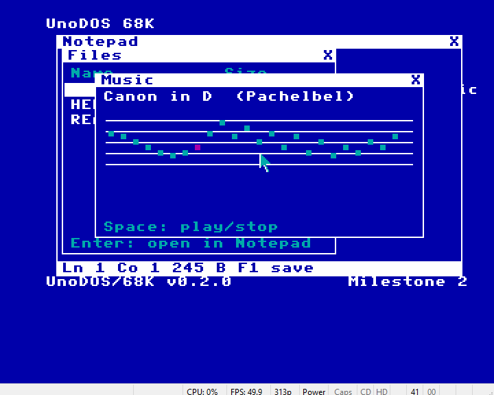

# UnoDOS/68K — Amiga port (milestone 2)

A bare-metal port of the UnoDOS desktop to the Commodore Amiga
(OCS/ECS, 68000, 512 KB chip RAM), built per `docs/PORT-SPEC.md` and the
plan in `docs/M68K-PORT-FEASIBILITY.md` (the Amiga was the recommended
first 68K target). This is **milestone 1**: a self-booting ADF that takes
over the machine and runs the UnoDOS desktop, window manager, and two
in-kernel apps.



## What works

- Boots from floppy with no Workbench/AmigaDOS: the bootblock LoadSegs the
  hunk executable, which enters supervisor mode and takes over interrupts,
  DMA, the display, and input.
- **320×200, 4 colors**, UnoDOS palette (blue desktop / cyan / magenta /
  white) via a copper list and 2 bitplanes.
- **Desktop**: menu-bar title, icon grid with labels (icons converted from
  the x86 app `.BIN` headers — same artwork), version/build footer.
- **Hardware-sprite mouse cursor** (the Amiga makes the cursor free — no
  XOR/save-under needed, so PORT-SPEC's "no drawing in ISRs" rule is
  trivially satisfied for the pointer).
- **Input**: quadrature mouse read at vblank; CIA-A keyboard ISR decoding
  rawkeys to ASCII; both feed the 32-entry focus-routable event queue.
  Press-time click latch + sequence counter exactly as PORT-SPEC §3
  prescribes.
- **Window manager**: frames, title bars, close box, z-order list,
  click-to-raise (title or body), title-bar drag with a self-erasing XOR
  outline and on-screen clamping. Bottom-up repaint = z-clip by paint
  order.
- **Apps** (milestone 2 — the x86 core trio + the originals):
  - **Files** — browses the boot **ROM-disk** (files from `amiga/disk/`
    baked into the kernel image at build time, editable in RAM until the
    MFM/FAT12 driver lands): name + size rows, white selection bar,
    arrow keys, Enter opens the file in Notepad.
  - **Notepad** — text editor: caret, insert/backspace/return, left/right
    arrows, and the **live status bar** (`Ln 1 Co 1 245 B`) updated on
    every keystroke (the x86 audit's stale-status fix is law). F1 saves
    back to the ROM-disk entry in RAM.
  - **Music** — Canon in D (the same arrangement as `apps/music.asm`) on
    a **Paula square wave** (channel 0, PAL periods), with a staff view,
    a magenta moving playback highlight, Space to play/stop.
  - SysInfo (live uptime) and Clock (HH:MM:SS), as before.
  - Launched by double-click or arrow-keys + Enter; ESC closes the
    topmost window; the focused (topmost) window owns the keyboard.
- Serial debug markers at 9600-8N1.

The screenshot above is the `test` build: Music topmost playing (magenta
note = sequencer position, verified advancing between captures), Files
with its selection bar behind, Notepad showing README.TXT with its live
status bar at the bottom.

## Build

Toolchain (free, Windows/Linux/macOS):

- **vasmm68k_mot** — Motorola-syntax 68k assembler. Easiest source: the
  `amiga-debug` VS Code extension VSIX bundles `vasmm68k_mot.exe` +
  `exe2adf.exe` (extract `extension/bin/win32/`), or build vasm from
  http://sun.hasenbraten.de/vasm/.
- **exe2adf** — packs a hunk exe into a bootable ADF (bundled as above).
- **Python 3** — generates `gen_data.i` (fonts, icons, keymap) from the
  x86 tree. Run `make floppy144` in the repo root first so the app
  `.BIN`s exist (icons are pulled from their headers).

```sh
cd amiga
./build.sh          # -> build/unodos68k.adf      (interactive)
./build.sh test     # -> build/unodos68k_test.adf (auto-launches apps)
```

Override tool paths with `VASM=`, `EXE2ADF=`, `PY=` env vars.

## Run / test

`uae/unodos.uae` is a WinUAE config for an A500-class machine using the
built-in AROS ROM (no copyrighted Kickstart needed):

```
winuae64.exe -f amiga/uae/unodos.uae
```

`uae/` also has the host-side test helpers used during development
(`snapwin.ps1` window capture, `autotest.ps1` boot+capture). Note: live
host→guest key injection is blocked by Windows desktop isolation in the
build-automation context, which is why the `test` build auto-launches apps
to exercise the interactive code paths; on a real desktop the interactive
build takes mouse and keyboard normally.

## Architecture

`kernel.asm` is one file, organized to mirror the portable-core boundary
the feasibility plan calls for — the WM, event queue, scheduler scaffolding,
and app procs are platform-independent in spirit; the Amiga-specific parts
(copper, bitplane primitives, CIA/sprite ISRs) are the future HAL. Data
(`gen_data.i`) is generated, not hand-written, so the fonts and icons stay
bit-identical to the x86 original.

## Known limitations (milestone 2)

- Storage is the boot ROM-disk (build-time files, RAM-editable); the
  portable FAT12 core + an MFM track reader are the next milestone.
- Notepad: 2 KB buffer; long lines clip (no horizontal scroll).
- Single cooperative context (the scheduler is scaffolding); real
  multitasking over the window/app tables is milestone 3.
- The vblank tick runs fast under WinUAE's default pacing for this config
  (uptime advances ~4× wall-clock) — a `TICKS_SEC` calibration item, not a
  logic bug; the latch/delta/refresh mechanism is correct.
- Bitplane text uses a general unaligned 2-byte RMW per row; the blitter
  fast path (the big Amiga win) is a later optimization.
