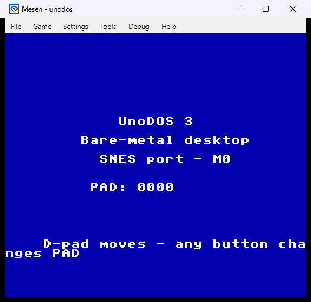

# UnoDOS/SNES — standalone OS for the 65816 Super Nintendo (milestone 0)

Like the other bare-metal UnoDOS ports, this is **a real operating
system**, not a game running on someone else's OS. The console powers on,
the CPU reset vector jumps straight into UnoDOS, and from the first
instruction UnoDOS owns the machine — its own PPU setup, its own tilemap
renderer, its own vblank interrupt handler, its own input. There is no
BIOS, no monitor, nothing else on the cartridge.

This port is the **Genesis port's twin** re-expressed in 65816: a
cell-based desktop composed on background tiles, a hardware-sprite cursor,
pad-as-pointer + soft keyboard, and a battery-SRAM mini-FS. The 65816
toolchain (cc65) is the one the Apple IIGS port introduces and the SNES
shares. See [HANDOFF.md](HANDOFF.md) for the full M0–M3 plan.

## Status

**M0 — DONE.** A LoROM `.sfc` boots in Mesen2 to the "UnoDOS 3" tile
splash and reacts to the joypad (the live controller word is rendered as
`PAD:xxxx`). This proves the whole foundation end to end: cartridge header
+ vectors, native-mode bring-up, the shared font as SNES tiles, the
palette, the **shadow + DMA** render architecture, the vblank NMI, and
auto-joypad input.



M1–M3 (desktop/WM/cursor/soft-keyboard, SRAM + apps + games, SPC700 audio
+ scheduler) are still ahead — see [HANDOFF.md](HANDOFF.md).

## The envelope (and its deviations)

- **65C816 @ 3.58 MHz**, 128 KB WRAM at `$7E:0000–$7F:FFFF`. The low 8 KB
  (`$7E:0000–$1FFF`) is mirrored into `$00:0000–$1FFF` of every bank — the
  65816 stack and direct page must live in bank 0, so the kernel keeps its
  state and the tilemap shadow there (`VARS = $0100`, `TMAP = $1000`),
  reachable both as bank-0 mirrors from the CPU and as real WRAM `$7E` from
  DMA.
- **Tile/sprite PPU, no bitmap mode** (same as Genesis). **Mode 1**: BG1 is
  the desktop plane (16-colour 4bpp tiles). The visible field is
  **256×224 ⇒ 32×28 cells** of 8 px. Genesis is 40×28; **this port's
  windows are narrower by 8 columns** — the documented deviation, the way
  macplus documents 512×342.
- **VRAM/CGRAM/OAM are write-only outside vblank or forced blank.** This is
  the one architectural inversion vs. Genesis (which writes its VDP from
  the main loop). See *The rendering rule* below.
- **Storage:** battery SRAM on the cartridge (M2). Declared as 0 KB at M0
  (ROM-only header) — SRAM arrives with the USV1 mini-FS.
- **Audio:** the SPC700 coprocessor with its own RAM + DSP, fed by an
  uploaded driver (M3).

## The rendering rule (decided at M0, HANDOFF §2)

The Genesis law was "all VDP access in the main loop; ISRs only set
state." The SNES **inverts the transfer half** because the PPU is only
writable during blank, so UnoDOS/SNES adopts this split from line one:

- The **main loop** (and later all app/WM code) renders into a **WRAM
  tilemap shadow** (32×32 words at `$7E:1000`) and sets a dirty flag. It
  never touches the PPU.
- The **NMI handler** (vblank) does the transfers and input: it DMAs the
  shadow to VRAM when dirty, acks the NMI, waits out the auto-joypad read
  and latches `JOY1` into the vars block, and counts the frame tick. No
  app/WM logic runs in the ISR (PORT-SPEC §6 rule 2) — it only moves
  prepared bytes and samples input.
- **Static tiles/palette** (font, chrome, icons) upload once at boot under
  forced blank; dynamic patterns will go through a per-frame DMA budget
  queue at M3.

At M0 the dirty flush rewrites the whole 2 KB tilemap each frame, which
fits comfortably in one vblank; dirty-row flushing is an M1 concern.

## Boot chain

1. Console reset → the 65816 starts in 6502 **emulation mode** and jumps
   through the emulation RESET vector at `$00:FFFC` to `Reset`.
2. `Reset` (kernel.asm): `clc/xce` to **native mode**, `rep #$38` (16-bit
   A/X/Y), stack to `$1FFF`, DB/DP = 0; forces blank (`$2100 = $8F`),
   clears the PPU registers, uploads the tile blob to the BG1 char base and
   the palette to CGRAM via DMA, composes the splash into the shadow and
   flushes it once, configures Mode 1 + BG1, then turns the screen on and
   enables NMI + auto-joypad (`$4200 = $81`).
3. The main loop `wai`s for the NMI, then re-renders the `PAD:xxxx` line
   from the latched joypad word and marks the shadow dirty; the next NMI
   flushes it. Forever.

## Cartridge layout

LoROM, 32 KB, slow ROM. The ld65 config ([lorom.cfg](lorom.cfg)) maps the
ROM to bank `$00` `$8000–$FFFF`, so a `$8000+` address X sits at file
offset `X − $8000` and the header lands at `$7FC0`:

| Addr | Field |
|---|---|
| `$FFC0` | title `UNODOS 3 - SNES PORT ` (21 bytes) |
| `$FFD5` | map mode `$20` (LoROM, slow) |
| `$FFD6` | cartridge type `$00` (ROM only) |
| `$FFD7` | ROM size `$05` (32 KB) |
| `$FFD9` | country `$01` (NTSC) |
| `$FFDC/$FFDE` | checksum complement / checksum (patched by build.sh) |
| `$FFEA` | native NMI vector → `NMI` |
| `$FFFC` | emulation RESET vector → `Reset` |

## Build

```sh
./build.sh           # -> build/unodos.sfc       (interactive: live joypad)
./build.sh test      # -> build/unodos_test.sfc  (AUTOTEST: synthetic input)
```

`build.sh` runs [mkdata.py](mkdata.py) (shared font → `gen_data.inc`),
assembles with `ca65 --cpu 65816`, links with `ld65 -C lorom.cfg`, and
patches the cartridge checksum. Toolchain: cc65 (ca65/ld65 V2.19) at
`C:\Users\arin\snes-tools\bin` — the same suite the IIGS port stands up.

### mkdata.py — the data format

The shared `kernel/font8x8.asm` (95 glyphs, ASCII 32–126, 1 byte/row,
MSB-left) is converted to **SNES 4bpp planar tiles**: 32 bytes per 8×8
tile, eight `(plane0,plane1)` row pairs then eight `(plane2,plane3)` pairs.
Glyphs are fg = palette index 1 on bg = index 2 (an opaque text cell, the
Genesis model). The palette is **BGR555** with entries 0–4 = the UnoDOS UI
colours (PORT-SPEC §1): DOS-blue backdrop/bg, white fg, cyan + magenta
accents.

## Test rig

Mesen2 (`C:\Users\arin\snes-tools\mesen\Mesen.exe`) is the regression
emulator (the BlastEm role). Two one-time/per-run scripts drive it:

```powershell
./setup_mesen.ps1                       # ONCE: dismiss first-run dialog +
                                        #       force the software renderer
./run_mesen.ps1 -Rom build\unodos_test.sfc -Out build\autotest.png
```

Two hard-won rig facts, both documented in the scripts:

1. **Software renderer is mandatory here.** Mesen draws the SNES picture on
   a GPU surface that `PrintWindow` returns *black* on this headless/RDP
   desktop (and `CopyFromScreen` fails outright). `setup_mesen.ps1` sets
   `Video.UseSoftwareRenderer = true` in `settings.json` so the viewport is
   capturable — the Mesen edition of the Genesis "software-under-RDP"
   lesson.
2. **Input is verified by AUTOTEST, not host keystrokes.** Mesen's CLI does
   not autoload a Lua script, and its key bindings are internal scancodes
   that are unreliable to inject under a background-focus desktop. So the
   `test` build self-injects a synthetic joypad value in the NMI (`PAD`
   flips `0000 → C0A0` after ~1.5 s) — the Genesis AUTOTEST fallback. The
   interactive build shows `PAD:0000` at rest and tracks the real
   controller; together they prove the read → shadow → DMA → display path.

The vars block carries the magic `"UDM1"` at `$7E:0100` (WRAM offset
`$0100`) as the discovery handle for future Mesen-Lua memory asserts,
should the script path become viable.

### Captured M0 evidence

- [build/desktop.png](build/desktop.png) — interactive build, `PAD:0000`.
- [build/autotest.png](build/autotest.png) — AUTOTEST build, `PAD:C0A0`
  with the `* AUTOTEST *` banner (the synthetic-input pipeline).

## Files

| File | Role |
|---|---|
| [kernel.asm](kernel.asm) | the M0 kernel: boot, PPU init, shadow renderer, NMI, splash |
| [mkdata.py](mkdata.py) | shared font/assets → `gen_data.inc` (4bpp tiles + BGR555 palette) |
| [lorom.cfg](lorom.cfg) | ld65 LoROM linker config |
| [build.sh](build.sh) | mkdata → ca65 → ld65 → checksum patch |
| [setup_mesen.ps1](setup_mesen.ps1) | one-time Mesen prep (dialog + software renderer) |
| [run_mesen.ps1](run_mesen.ps1) | launch + screenshot rig |
| [HANDOFF.md](HANDOFF.md) | the full M0–M3 implementation plan |

## Next (M1)

Cell renderer primitives (draw_char/string/window chrome on the shadow),
the window manager (PORT-SPEC §2 invariants, 8-px snapping), pad-as-pointer
input verbatim from Genesis + the soft keyboard (`genesis/softkbd.i`), SNES
Mouse detection, and the SysInfo + Clock apps. See [HANDOFF.md](HANDOFF.md)
§4.
